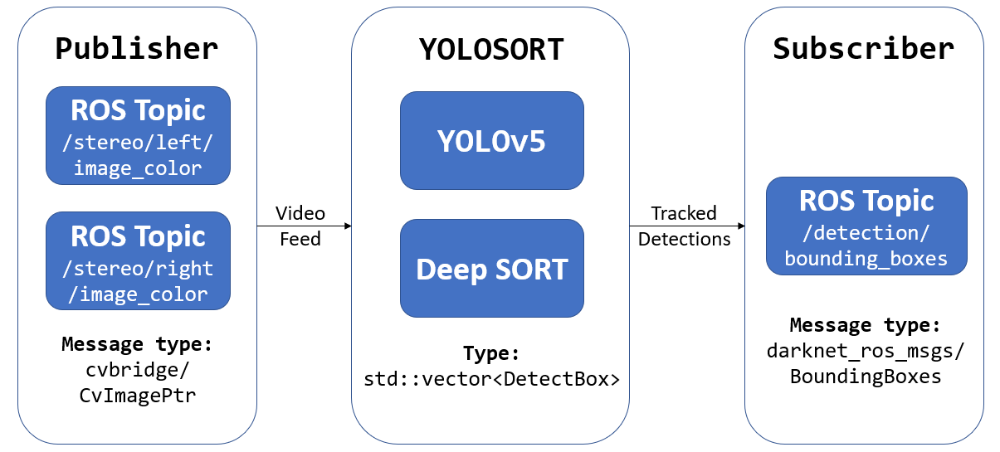

# Real-Time Multi-Drone Detection and Tracking for Pursuit-Evasion with Parameter Search
[](https://opensource.org/licenses/MIT)

Highlights: This repository uses fine-tuned yolov5, deepsort and ROS to perform multi-drone detection and tracking, which can run for both Jetson Xavier NX and Jetson Nano.

## Abstract
Real-time multi-object detection and tracking are primarily required for intelligent multi-vehicle systems. This paper presents a whole life cycle multi-drone detection and tracking approach for collaborative drone pursuit-evasion operations, incorporating parameter search and edge acceleration techniques. Specifically, to address the single drone detection limitation of existing drone datasets, we first collect a new dataset "UAVG-Drone" from various environments and then establish a model benchmark with different YOLOv5 models. The hyperparameter of YOLOv5s is further fine-tuned with a genetic algorithm with 26.9\% improvement in terms of mean average precision (mAP). Moreover, we develop an edge-accelerated detector and tracking system Drone-YOLOSORT focusing on "evader" and "pursuer" drones using TensorRT and deliver a ROS package for modular integration. Our system is able to reach about 24.3 FPS during inferencing, fulfilling the criteria of real-time drone detection at 20 FPS.

## Pipeline
<div style="text-align: center">

</div>

## Sample Inference
<div style="text-align: center">

</div>


## Requirements
1. Jetson Nano or Jetson Xavier NX
2. Jetpack 4.5.1
3. python3 (comes with default installation in Jetson Nano or Jetson Xavier NX)
4. tensorrt 7.1.3.0
5. torch 1.8.0
6. torchvision 0.9.0
7. torch2trt 0.3.0
8. onnx 1.4.1
9. opencv-python 4.5.3.56
10. protobuf 3.17.3
11. scipy 1.5.4


<!-- ## Speed

The whole process time from read image to finished deepsort (include every img preprocess and postprocess)
and attention!!! the number of deepsort tracking is 70+, not single or 10-20 persons, is 70+. And all results can be in Jetson Xavier NX.
| Backbone        | before TensorRT without tracking |before TensorRT with tracking |TensortRT(detection)| TensorRT(detection + tracking) | FPS(detection + tracking) |
| :-------------- | --------------- | ------------------ |--------------|------------------------------ | ------------------------- |
| Yolov5s_416      | 100ms           | 0.9s|10-15ms|100-150ms                          | 8 ~ 9                   |
| Yolov5s-640 | 120ms             | 1s|18-20ms|100-150ms                      | 8 ~ 9                     |

------ -->

## Build and Run 
Follow the instructions from [darknet_ros](https://github.com/leggedrobotics/darknet_ros) and build in your `catkin_ws`.

You may run the ros app either as an executable or ros package.

### Run using executable
```shell
git clone https://github.com/NTU-UAVG/multidrone-detection-tracking.git
cd multidrone-detection-tracking

// before you cmake and make, please change ./src/main.cpp char* yolo_engine = ""; char* sort_engine = ""; to your own path

mkdir build 
cd build
cmake ..
make && rm ./yolosort && mv devel/lib/yolosort/yolosort ./ 
```
if you face any errors, please see this [article](https://blog.csdn.net/weixin_42264234/article/details/120152117) or see `Errors` section.

### Run using rosrun
- Clone the repository into the `src` folder
```shell
cd ~/catkin_ws/src
git clone https://github.com/NTU-UAVG/multidrone-detection-tracking.git
```
- Create a folder named `resources` inside `multidrone-detection-tracking` and add the `yolov5s.engine` and `deepsort.engine` inside this folder.
```shell
cd multidrone-detection-tracking
mkdir resources
// add both engine files in resources
```


- Build yolosort using `catkin build`
```shell
cd ~/catkin_ws
catkin build yolosort
```

- Run yolosort package
```shell
source ~/catkin_ws/devel/setup.bash
rospack list        // check if yolosort package exist
rosrun yolosort yolosort
```


## ROS commands
- First tab: Start roscore
```shell 
roscore
```
- Second tab: Echo the publisher
```shell
source ~/catkin_ws/devel/setup.bash
rostopic echo /detection/bounding_boxes 
```
- Third tab: Start yolosort from executable or ros (Refer to Build and Run above)

- Fourth tab: Start stream input from rosbag file
```shell
rosbag play <BAGFILE.bag>
```

## Dataset
The "UAVG-Drone" dataset can be found in [Drone Dataset](https://drive.google.com/drive/folders/1-RzSz0rukpcSXK2yFgsa0Ubnl3FPRx59?usp=sharing). 

<div style="text-align: center">

</div>
<p align="left"><i>Dataset distribution from various resources </i></p>


<div style="text-align: center">

</div>
<p align="left"><i>Data property distribution </i></p>

<div style="text-align: center">

</div>
<p align="left"><i>Data property correlogram </i></p>

## Model
You need two models, one is the yolov5 model for detection, which is generated from [tensorrtx](https://github.com/wang-xinyu/tensorrtx). The other model is the deepsort model used for tracking.

There are two models to be generated, one for yolov5 and one for deepsort. The models can be found under resources.

### YOLOv5 model training
Yolov5s was chosen for this project. You can use the following Colab notebook to train on the drones dataset. <a href="https://colab.research.google.com/drive/1ruLEtq_tsy0xN2vebTKmnCOIAOwvgwcB?usp=sharing"></a>


Note that pretrained models for deepsort can be retrieved from [deepsort](https://github.com/ZQPei/deep_sort_pytorch). If you need to use your own model, refer to the `For Other Custom Models` section.
You can also refer to [tensorrtx official readme](https://github.com/wang-xinyu/tensorrtx/tree/master/yolov5).

The following is deepsort.onnx and deesort.engine files, you can find in baiduyun and [https://github.com/RichardoMrMu/yolov5-deepsort-tensorrt/releases/tag/yolosort](https://github.com/RichardoMrMu/yolov5-deepsort-tensorrt/releases/tag/yolosort)
| Model| Url |
| :-------------- | --------------- |
| 百度云 | [BaiduYun url](https://pan.baidu.com/s/1vpQFsD346lP64O1nhOilkw ) passwd:`z68e`| 


### Convert YOLOv5 model to engine file.
1. Get yolov5 repository
Although yolov5 v6.1 is available, currently yolov5 v6.0 is only supported due to tensorrtx. Please ensure your yolov5 code is v6.0.

```shell
git clone -b v5.0 https://github.com/ultralytics/yolov5.git
cd yolov5
mkdir weights
cd weights
// copy yolov5 pt file to here.
```

2. Get tensorrtx.
```shell
cd ../..
git clone https://github.com/wang-xinyu/tensorrtx
```

3. Generate `yolov5.wst` model. If there is a segmentation fault core dumped or illegal operation while generating the `yolov5.wst` file, you can use the following notebook to generate the files.  <a href="https://colab.research.google.com/drive/1vP-Js2SrubJe_ZtVRs0ACxfaCDK2Auc5?usp=sharing"></a>


```shell
cp tensorrtx/gen_wts.py yolov5/
cd yolov5 
python3 gen_wts.py -w ./weights/yolov5s.pt -o ./weights/yolov5s.wts
// a file 'yolov5s.wts' will be generated.
```
`yolov5s.wts` model will be generated in `yolov5/weights/`.

4. Build tensorrtx/yolov5 to generate `yolov5.engine`. Update the `CLASS_NUM，INPUT_H,INPUT_W` in `tensorrtx/yolov5/yololayer.h` lines 20,21 and 22 before making. 


In `yololayer.h`,
```shell
// before 
static constexpr int CLASS_NUM = 80; // line 20
static constexpr int INPUT_H = 640;  // line 21  yolov5's input height and width must be divisible by 32.
static constexpr int INPUT_W = 640; // line 22

// after 
// if your model is 2 classfication and image size is 608*608
static constexpr int CLASS_NUM = 2; // line 20
static constexpr int INPUT_H = 608;  // line 21  yolov5's input height and width must be divisible by 32.
static constexpr int INPUT_W = 608; // line 22
```


```shell 
cd tensorrtx/yolov5
// update CLASS_NUM in yololayer.h if your model is trained on custom dataset
mkdir build
cd build
cp {ultralytics}/yolov5/yolov5s.wts {tensorrtx}/yolov5/build
cmake ..
make
// serialise yolov5s engine file
sudo ./yolov5 -s yolov5s.wts yolov5s.engine s
// test your engine file
sudo ./yolov5 -d yolov5s.engine ../samples
```
5. After generating the yolov5s.engine, and you can place `yolov5s.engine` in the main project. For example
```shell
cd {yolov5-deepsort-tensorrt}
mkdir resources
cp {tensorrtx}/yolov5/build/yolov5s.engine {yolov5-deepsort-tensorrt}/resources
```

6. Get deepsort engine file
You can get deepsort pretrained model in this [drive url](https://drive.google.com/drive/folders/1xhG0kRH1EX5B9_Iz8gQJb7UNnn_riXi6)
and ckpt.t7. The `deepsort.engine` file can also be found in the releases.
```shell
git clone https://github.com/RichardoMrMu/deepsort-tensorrt.git
// 根据github的说明
cp {deepsort-tensorrt}/exportOnnx.py {deep_sort_pytorch}/
python3 exportOnnx.py
mv {deep_sort_pytorch}/deepsort.onnx {deepsort-tensorrt}/resources
cd {deepsort-tensorrt}
mkdir build
cd build
cmake ..
make 
./onnx2engine ../resources/deepsort.onnx ../resources/deepsort.engine
// test
./demo ../resource/deepsort.engine ../resources/track.txt
```
You may then add both the `yolov5s.engine` and `deepsort.engine` into the project.


## FAQ
<details>
<summary>Different versions of yolov5</summary>

Currently, tensorrtx support yolov5 v1.0(yolov5s only), v2.0, v3.0, v3.1, v4.0, v5.0 and v6.0. v6.1 supports exporting to TensorRT ([see here](https://github.com/ultralytics/yolov5/releases/tag/v6.1)) but does not export to TensorRT 7.1.3.0.

- For yolov5 v5.0, download .pt from [yolov5 release v5.0](https://github.com/ultralytics/yolov5/releases/tag/v5.0), `git clone -b v5.0 https://github.com/ultralytics/yolov5.git` and `git clone https://github.com/wang-xinyu/tensorrtx.git`, then follow how-to-run in current page.
- For yolov5 v4.0, download .pt from [yolov5 release v4.0](https://github.com/ultralytics/yolov5/releases/tag/v4.0), `git clone -b v4.0 https://github.com/ultralytics/yolov5.git` and `git clone -b yolov5-v4.0 https://github.com/wang-xinyu/tensorrtx.git`, then follow how-to-run in [tensorrtx/yolov5-v4.0](https://github.com/wang-xinyu/tensorrtx/tree/yolov5-v4.0/yolov5).
- For yolov5 v3.1, download .pt from [yolov5 release v3.1](https://github.com/ultralytics/yolov5/releases/tag/v3.1), `git clone -b v3.1 https://github.com/ultralytics/yolov5.git` and `git clone -b yolov5-v3.1 https://github.com/wang-xinyu/tensorrtx.git`, then follow how-to-run in [tensorrtx/yolov5-v3.1](https://github.com/wang-xinyu/tensorrtx/tree/yolov5-v3.1/yolov5).
- For yolov5 v3.0, download .pt from [yolov5 release v3.0](https://github.com/ultralytics/yolov5/releases/tag/v3.0), `git clone -b v3.0 https://github.com/ultralytics/yolov5.git` and `git clone -b yolov5-v3.0 https://github.com/wang-xinyu/tensorrtx.git`, then follow how-to-run in [tensorrtx/yolov5-v3.0](https://github.com/wang-xinyu/tensorrtx/tree/yolov5-v3.0/yolov5).
- For yolov5 v2.0, download .pt from [yolov5 release v2.0](https://github.com/ultralytics/yolov5/releases/tag/v2.0), `git clone -b v2.0 https://github.com/ultralytics/yolov5.git` and `git clone -b yolov5-v2.0 https://github.com/wang-xinyu/tensorrtx.git`, then follow how-to-run in [tensorrtx/yolov5-v2.0](https://github.com/wang-xinyu/tensorrtx/tree/yolov5-v2.0/yolov5).
- For yolov5 v1.0, download .pt from [yolov5 release v1.0](https://github.com/ultralytics/yolov5/releases/tag/v1.0), `git clone -b v1.0 https://github.com/ultralytics/yolov5.git` and `git clone -b yolov5-v1.0 https://github.com/wang-xinyu/tensorrtx.git`, then follow how-to-run in [tensorrtx/yolov5-v1.0](https://github.com/wang-xinyu/tensorrtx/tree/yolov5-v1.0/yolov5).
</details>

<details>

<summary>Config</summary>

- Choose the model s/m/l/x/s6/m6/l6/x6 from command line arguments.
- Input shape defined in yololayer.h
- Number of classes defined in yololayer.h, **DO NOT FORGET TO ADAPT THIS, If using your own model**
- INT8/FP16/FP32 can be selected by the macro in yolov5.cpp, **INT8 need more steps, pls follow `How to Run` first and then go the `INT8 Quantization` below**
- GPU id can be selected by the macro in yolov5.cpp
- NMS thresh in yolov5.cpp
- BBox confidence thresh in yolov5.cpp
- Batch size in yolov5.cpp
</details>


## For Other Custom Models
You may need train your own model and transfer your trained model to tensorRT. 
1. Train Custom Model

Follow the [official wiki](https://github.com/ultralytics/yolov5/wiki/Train-Custom-Data) to train your own model on your dataset. For example, I choose yolov5-s to train my model.

2. Transfer Custom Model

Just like [tensorRT official guideline](https://github.com/wang-xinyu/tensorrtx/edit/master/yolov5/), transfer your pytorch model to tensorrt.
Change `yololayer.h` lines 20,21 and 22 (CLASS_NUM，INPUT_H,INPUT_W) to your own parameters.


```shell
cd {tensorrtx}/yolov5/
// update CLASS_NUM in yololayer.h if your model is trained on a custom dataset

mkdir build
cd build
cp {ultralytics}/yolov5/yolov5s.wts {tensorrtx}/yolov5/build
cmake ..
make
sudo ./yolov5 -s [.wts] [.engine] [s/m/l/x/s6/m6/l6/x6 or c/c6 gd gw]  // serialize model to plan file
sudo ./yolov5 -d [.engine] [image folder]  // deserialize and run inference, the images in [image folder] will be processed.
// For example yolov5s
sudo ./yolov5 -s yolov5s.wts yolov5s.engine s
sudo ./yolov5 -d yolov5s.engine ../samples
// For example Custom model with depth_multiple=0.17, width_multiple=0.25 in yolov5.yaml
sudo ./yolov5 -s yolov5_custom.wts yolov5.engine c 0.17 0.25
sudo ./yolov5 -d yolov5.engine ../samples
```

## Errors
- If you meet the following error during building `fatal error: Eigen/Core: No such file or directory #include <Eigen/Core>`. Run the following 
```shell
sudo ln -s /usr/include/eigen3/Eigen /usr/include/Eigen
```

- The following problem may occur when generating the `wts` file.
```shell
ImportError: /usr/lib/aarch64-linux-gnu/libgomp.so.1: cannot allocate memory in static TLS block
```
Run the following in terminal. [Credits](https://github.com/keras-team/keras-tuner/issues/317)
```shell
export LD_PRELOAD=/usr/lib/aarch64-linux-gnu/libgomp.so.1
```

- When making yolosort, the following errors occur due to `OpenCV` in Jetson Xavier.
```
CMake Error at /opt/ros/melodic/share/cv_bridge/cmake/cv_bridgeConfig.cmake:113 message): Project 'cv_bridge' specifies '/usr/include/opencv' as an include dir, which is not found.  It does neither exist as an absolute directory nor in '${{prefix}}//usr/include/opencv'. Check the issue tracker 'https://github.com/ros-perception/vision_opencv/issues' and consider creating a ticket if the problem has not been reported yet.
```

Open the file `/opt/ros/melodic/share/cv_bridge/cmake/cv_bridgeConfig.cmake`
and change the line. [Credits](https://github.com/ros-perception/vision_opencv/issues/345)

`set(_include_dirs "include;/usr/include;/usr/include/opencv")`
to `set(_include_dirs "include;/usr/include;/usr/include/opencv4")`


